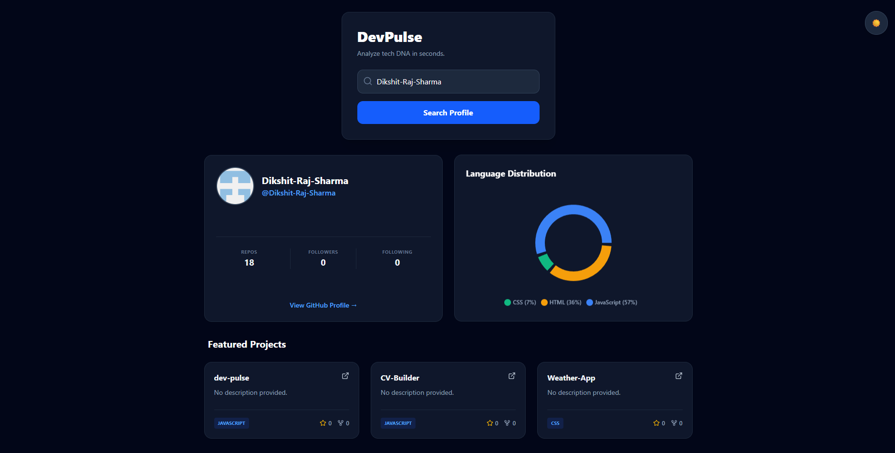

<p align="center">
  

</p>
<h1 align="center">DevPulse</h1>
<p align="center">
  GitHub analytics dashboard for developer insights
</p>

**DevPulse** is a modern, responsive GitHub analytics dashboard built to visualize developer profiles and repository statistics in real-time. Unlike standard user finders, DevPulse provides deep insights into language usage and top-performing projects with a polished, theme-aware UI.

<p align="center">
  
</p>

## ✨ Key Features

- **📊 Tech DNA Analysis:** Visualizes programming language distribution using interactive charts (Recharts).
- **🌗 Custom Theme Engine:** A fully persistent Dark Mode built from scratch using **Tailwind CSS v4** variables and LocalStorage.
- **🏆 Smart Project Sorting:** Automatically identifies and highlights top 3 repositories based on a weighted logic of Stars and Forks.
- **⚡ Reactive UI:** Built with Vite for instant feedback, featuring smooth CSS transitions and hover effects.
- **📱 Fully Responsive:** Adaptive grid layouts that work seamlessly on mobile, tablet, and desktop.

## 🛠️ Tech Stack

- **Core:** React.js (Vite)
- **Styling:** Tailwind CSS v4 (Alpha/Beta via Vite Plugin)
- **Visualization:** Recharts
- **Icons:** Lucide-React
- **Data Fetching:** Axios
- **API:** GitHub REST API

## 🚀 Getting Started

### Prerequisites

Make sure you have Node.js installed on your machine.

### Installation

1. **Clone the repository**
   ```bash
   git clone [https://github.com/Dikshit-Raj-Sharma/dev-pulse.git](https://github.com/Dikshit-Raj-Sharma/dev-pulse.git)
   cd dev-pulse
   ```
2. **Install dependencies**
   ```bash
   npm install
   ```
3. **Start the development server**
   ```bash
   npm run dev
   ```
4. **Open in browser:** Visit http://localhost:5173 to view the app.


## ⚠️ API Rate Limits

This project uses the public GitHub API.

**Limit:** 60 requests per hour per IP address.

> **Note:** If charts or data stop loading, you may have hit this limit.  
> Please wait **30–60 minutes** for it to reset.

## 📂 Project Structure
```
src/
├── components/
│   ├── LanguageCharts.jsx  # Pie chart logic for language stats
│   ├── ProfileCard.jsx     # User bio and follower stats
│   ├── RepoList.jsx        # Top 3 featured projects
│   └── SearchBar.jsx       # Input handling with error states
├── App.jsx                 # Main state manager & theme logic
└── index.css               # Tailwind v4 configuration (@theme)
```

## 🤝 Contributing
Contributions are welcome! Please open an issue or submit a pull request for any improvements.